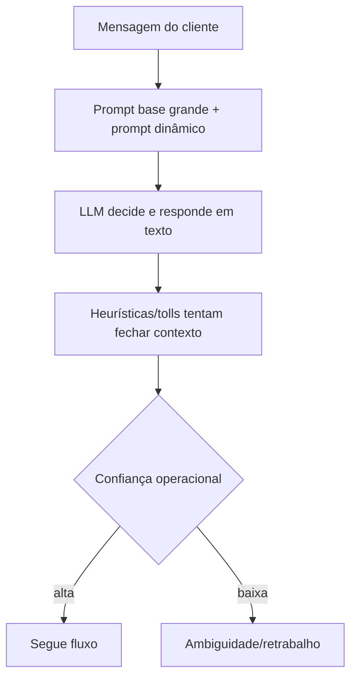
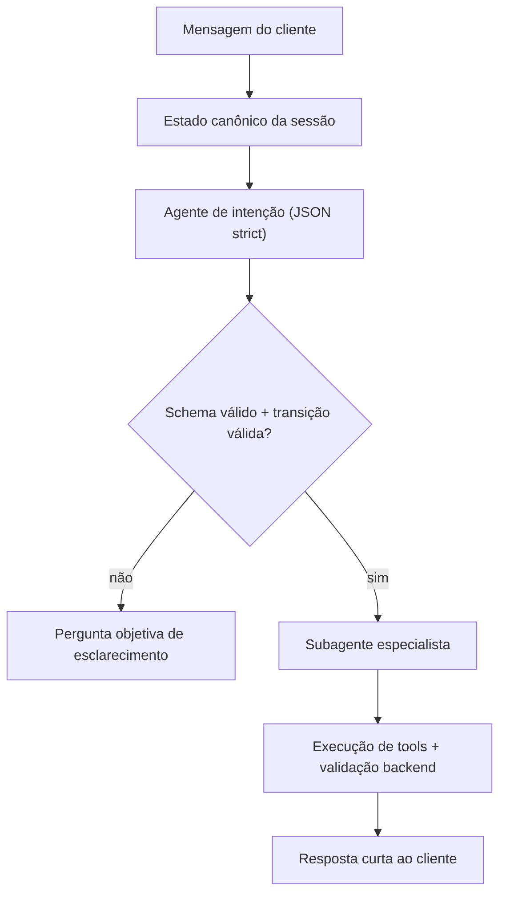

# Pesquisas e Decisões (até antes do pedido de geração de prompt)

Data de consolidação: 2026-05-12
Workspace: `c:\Users\Geinfo\schumacher-tur`

## 1) Objetivo da análise
Avaliar por que a IA de atendimento/vendas está se perdendo em decisões simples (ex.: seleção de opção, continuidade de fluxo) e definir a melhor direção técnica para melhorar confiabilidade, sem alterar código nesta etapa.

## 2) Evidências levantadas no sistema atual

### 2.1 Arquivos centrais identificados
- `apps/api/internal/chat/prompt_builder.go`
- `apps/api/internal/chat/service.go`
- `apps/api/internal/chat/tool_router.go`
- `apps/api/internal/chat/openai_runner.go`
- `apps/api/internal/chat/agent.go`
- `apps/api/internal/chat/handler.go`
- `apps/api/internal/automation/chat_buffer_flush_loop.go`

### 2.2 Constatações principais
1. Existe um **prompt base muito grande** (`defaultAgentSystemPrompt`) com muitas regras, exceções e guardrails em texto.
2. Existe também um **prompt dinâmico extenso** (`buildAgentUserPrompt`) com histórico, contexto derivado e resultados de ferramentas.
3. O sistema já tem ferramentas internas (availability, booking, payments, document extract etc.), mas parte importante da decisão ainda depende de interpretação textual.
4. O fluxo de geração continua muito acoplado: decisão + redação da resposta no mesmo ciclo cognitivo do modelo.

## 3) Pesquisa web (OpenAI) e conclusão técnica

### 3.1 Fontes consultadas
- Conversation state: [OpenAI Docs](https://platform.openai.com/docs/guides/conversation-state?api-mode=responses)
- Function calling + structured outputs: [OpenAI Docs](https://platform.openai.com/docs/guides/function-calling/function-calling-with-structured-outputs?api-mode=responses)
- Structured outputs: [OpenAI Docs](https://platform.openai.com/docs/guides/structured-outputs?api-mode=chat)
- Responses API reference: [OpenAI Docs](https://platform.openai.com/docs/api-reference/responses?lang=node.js)
- Prompt caching: [OpenAI Docs](https://platform.openai.com/docs/guides/prompt-caching)

### 3.2 Conclusão da pesquisa
A melhor forma de resolver o problema não é “aumentar prompt” nem depender apenas de embeddings. A direção recomendada é:
1. **Conversation state nativo** para continuidade (evitar remontar histórico gigante por turno).
2. **Structured outputs / function calling com schema estrito** para decisões.
3. **Estado canônico no backend** como fonte de verdade.
4. Prompt base **mínimo** e estável.

## 4) Decisões arquiteturais tomadas na conversa

1. O problema raiz é **complexidade sistêmica**, não um único caso pontual.
2. “Quero a primeira” foi tratado apenas como sintoma de fragilidade geral.
3. Devemos separar responsabilidades:
   - decisão estruturada
   - execução de ação (tools/backend)
   - realização textual da resposta
4. Reduzir drasticamente o prompt e remover partes dinâmicas desnecessárias.
5. Manter políticas críticas em validações/backend, não em instruções longas.
6. Usar JSON strict como contrato de decisão antes de qualquer ação sensível.
7. Embeddings são complementares para recuperação semântica, mas não solução principal para decisão transacional.

## 5) Modelo atual vs esperado (resumo)

### 5.1 Atual
- Prompt grande + prompt dinâmico grande
- Decisão e redação misturadas
- Forte dependência de linguagem natural para continuidade
- Maior chance de inconsistência em turnos simples

### 5.2 Esperado
- Prompt curto e estável
- Decisão em JSON estrito
- Estado canônico e transições validadas no backend
- Resposta textual curta baseada em decisão já validada

## 6) Proposta de agentes (definida na conversa)
- 1 agente de intenção (orquestrador)
- 3 subagentes:
  1. Geral (documentos, rotas, datas, valores)
  2. Agendamentos (reservas/reagendamentos/cancelamentos)
  3. Pagamentos (status/cobrança/PIX)

## 7) Diretriz final aprovada
A melhoria deve priorizar confiabilidade operacional e previsibilidade:
- menos prompt
- mais estrutura
- mais validação determinística
- melhor gestão de memória de conversa na API da OpenAI

---

## Apêndice A — Fluxo atual (desenho)

## Apêndice B — Fluxo esperado (desenho)

